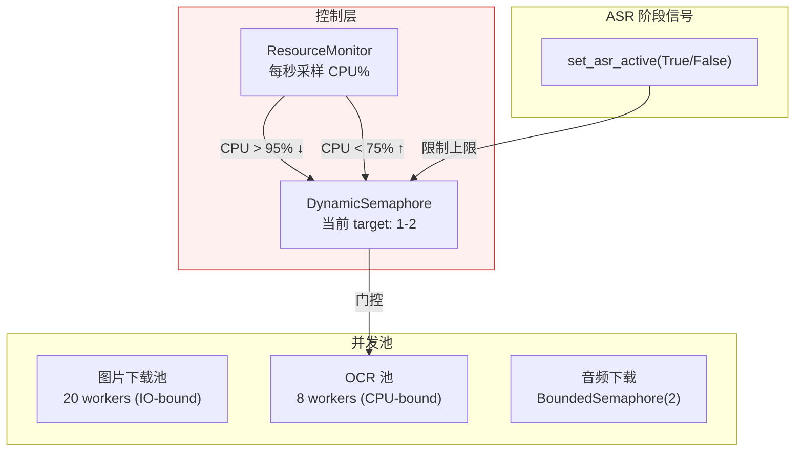
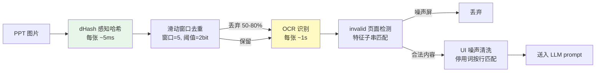

# 早期 V2 技术设计记录

本文归档自原 README，保留早期调度器、SenseVoice/FireRed 性能与数据库设计的讨论。它不是当前实现或部署指南；历史测量不用于推断 Qwen 性能。当前流程以 [README](../README.md)、[正式处理链](parallel-course-pilot.md)及源码为准。

## 技术说明

以下调度器与 SenseVoice 性能数据保留为历史设计说明，不作为本分支 Qwen 的性能或实现结论。当前运行参数以 [Qwen 运行说明](qwen-only-runtime.md) 和源码为准。

> 以下部分是对本项目技术细节和设计的讨论，欢迎感兴趣的技术读者阅读。

### 调度器：CPU 反馈闭环

OCR 和 ASR 是两个 CPU-bound 工作负载，在 4 核 GitHub Actions runner 上需要共享算力。RapidOCR 每处理一页 PPT 图片约需 1 秒，保持单核 100% 占用；sherpa-onnx ASR 使用 4 线程 ONNX 推理，需要多核。ASR 的优先级高于 OCR——转录延迟会导致音频流中断。

动态信号量：标准库 BoundedSemaphore 不支持在运行时调整并发上限。DynamicSemaphore 在线程安全的基础上增加了 `set_target(n)` 方法，允许在运行时调高/调低并发目标。正在执行的 worker 不受影响（自然结束后不再补充），等待中的 worker 在 target 上调时被唤醒。

资源监控：ResourceMonitor 每秒采样 `psutil.cpu_percent()`，执行迟滞判断（hysteresis control）：当 CPU > 95% 且 target 尚未到达下限时递减 OCR 并发；当 CPU < 75% 且 target 尚未到达上限时递增。双阈值（95%/75%）制造了一个 20% 宽的死区（deadband），避免系统在单个阈值附近震荡。这套逻辑本质上是一个 bang-bang 控制器。

OCR_MAX_TARGET 设为 2 而非 8 的原因是：实际运行数据表明，RapidOCR 在 4 核机器上从未超过 2 个并发 worker——其余核心被 ASR 的 4 线程 ONNX 推理占满。更高的 target 仅导致 ResourceMonitor 频繁调整目标值，对吞吐无贡献。

ASR 阶段通过 `set_asr_active(True/False)` 向调度器主动声明状态。这是一个简单的布尔标志位，不需要细粒度的上下文切换，因为 ASR 和 OCR 是两个完全独立的阶段——ASR 运行时没有 OCR 依赖，反之亦然。

音频下载器使用 `BoundedSemaphore(2)` 限制并发 ffmpeg 数量。2 是理论最小值：当前转录课次需要一路，预取课次需要另一路。在 runner 的网络带宽下，两路 ffmpeg 公平共享带宽，各获得约 10 MB/s，远高于 ASR 消费速率。

### 语音识别：后处理优于更好的模型

该模块经历了 SenseVoice → FireRed → SenseVoice 的三次选择。FireRed 的转录文本更"干净"（纯中文 + 英文，无跨语种污染），但 SenseVoice 的实时倍率约 25x，FireRed 仅约 6x。在 348 节课的批量场景中，FireRed 的 ASR 总时长为 2h41m，SenseVoice 降至约 37m。当将两种模型的输出分别输入 DeepSeek-V4-Pro 生成摘要时，LLM 的摘要质量差异不显著——LLM 自动忽略了 SenseVoice 混入的日语假名和韩语谚文。

最终选择 SenseVoice 并附加后处理。后处理函数在每条 ASR segment 加入 segments 列表前执行多级清洗：删除日语假名和平假名/片假名 Unicode 区块、删除韩语谚文 Unicode 区块、删除英文 filler word 白名单（yeah, okay, uh, um, hmm 等）、删除 `<sil>` 和 `<|zh|>` 等 bracket token。技术英文（CNN, YOLO, Transformer）通过 `\b` 单词边界匹配不受影响。

每条清洗规则都经过 7 节课 × 5 门课的真实 OCR 数据验证。选择保留"well"——"well-defined"、"well-known"在技术英文中合法。

VAD 参数调优：Silero VAD 的默认 `min_silence_duration=0.25s` 在课堂场景中将老师的换气、翻页、停顿都切分为独立片段。每个片段需要一次 ASR decode，且 SenseVoice 在短片段（2-3s）上的语言检测倾向于误判为日语（因为缺乏上下文）。将参数调至 0.8s，并将 `max_speech_duration` 设为 30.0s（匹配 SenseVoice 训练感受野）。片段数量减少约 60%，日语误判率大幅下降。

### PPT 流水线：计算成本驱动的去重策略

iCourse 录播系统每 20-30 秒截取桌面截图。90 分钟课程产生约 200-300 张图片，其中大量是同一张幻灯片的重复截图。直接 OCR 全部图片将浪费大量计算时间和 LLM prompt token 预算。

去重采用两阶段策略：先以 dHash 感知哈希做粗筛，再以 OCR 文本分类做精筛。dHash 的计算成本约每张几毫秒，而 OCR 约每张 1 秒——因此在 OCR 之前执行。

滑动窗口去重有一个关键实现细节：已丢弃的页面不成为锚点。防止级联效应——如果第 1 页与第 3 页相似（第 3 页被丢弃），第 2 页与第 4 页相似但第 1 页与第 4 页无关，我们不希望第 1 页引发第 3 页被丢弃后，第 3 页又作为锚点引发第 4 页被丢弃。

OCR 之后执行 invalid 页面检测：通过特征子串匹配（约 20 条模式，如"请不要关闭设备""cfdfudaneducn""智慧教学资源平台使用规范"）识别教室桌面壁纸和 iCourse 资源平台启动页。归一化去掉所有非字母数字字符以容忍 OCR 轻微变异。

PPT 功能区 UI 噪声清洗：PowerPoint 功能区标签（"文件""开始""插入""设计"……）每次截图都被 OCR 识别，占用了 8-18% 的 LLM prompt token。清洗采用按行精确匹配策略，而非子串匹配——例如"选择"在功能区是按钮，在生物学"自然选择"中是正常文本。功能区标签在截图中独占一行，而同一词汇出现在课程内容中时周围有其他文字。100+ 条停用词在 7 节课 × 5 门课数据中零误删。

### 数据库持久化：三环境兼容的加密 + 内容寻址分片

GitHub Actions 每次在全新容器中运行，无法依赖本地文件系统持久化。解决方案是独立的 `data` 分支，每次运行结束时加密推送数据库，下次运行时拉取解密。

本 Fork 的持久化数据库使用独立 `DB_ENCRYPTION_KEY`，避免数据库加密强度与 UIS
密码绑定。未配置该 Secret 时仅保留旧版 UIS 派生方式作为兼容回退；新的个人部署
必须配置独立密钥。前端由用户在当前会话中直接输入该密钥，明文不写入持久化存储。

分片的动机是增量传输。数据库约 20MB，通过 GitHub API 完整拉取会显著增加前端加载时间。按课程分组切割为 ~10MB 的 shard，每个独立加密。前端使用 git blob SHA 作为缓存键存储于 IndexedDB，未变化的 shard 自动跳过网络下载、解密、解压。

并发保护：所有会写入 `data` 分支的 workflow 共用同一 concurrency group，按顺序
执行。发布前重新读取远端并由 `merge_db.py` 做 field-level COALESCE 合并，随后执行
SQLite 完整性检查；最终使用普通 fast-forward push 保留历史。如果远端在发布窗口内
发生意外变化，推送会安全失败而不会强制覆盖。

Schema 迁移：新增列时，旧的 shard 与新的 schema 之间存在列数不匹配的兼容性问题。`_migrate_shard_schema()` 在 INSERT 之前对每个 attached shard 执行 PRAGMA table_info 差集检查并通过 ALTER TABLE ADD COLUMN 补齐，将 schema 迁移与 shard 管理解耦。

### 前端：在静态页面中解密远程数据库

前端是运行在 GitHub Pages 上的纯静态单页应用，无后端服务器。它通过 GitHub raw API 拉取位于 `data` 分支的加密 shard，在浏览器中使用 Web Crypto API 解密，并利用 sql.js（SQLite WebAssembly 编译）在内存中构建数据库。

解密凭证是独立的 `DB_ENCRYPTION_KEY`，不经过网络传输，在浏览器本地内存中完成解密。

订阅编辑器解决了一个特殊的约束：GitHub Actions Secrets API 只支持写入，不支持读取——无法通过 API 获知当前 COURSE_IDS 的值。数据库 `meta` 中保存最近一次运行使用的订阅列表，前端据此显示当前状态；保存时通过 GitHub API 将完整选择列表写回 `COURSE_IDS` Secret。

### 技术方法总结

- **控制理论**：ResourceMonitor 的双阈值迟滞比较器（deadband control），防止在单个阈值附近震荡。
- **排队论**：DynamicSemaphore 的可调整并发池，系统过载时减少服务窗口，负载下降后恢复。不影响正在服务的 worker，只影响等待队列。
- **CRDT 思想**：merge_db.py 的 field-level COALESCE，最终一致的并发合并策略。
- **内容寻址存储**：前端以 git blob SHA 为 shard 缓存键，相同内容产生相同 SHA 的特性直接复用。
